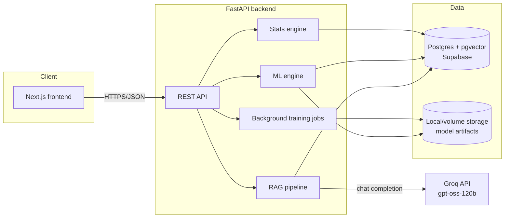

# Architecture

## System overview

## Request flow: running an A/B test

1. Frontend posts raw numbers (Simple Test) or an uploaded dataset + column choices (Advanced Analysis) to `/api/experiments/simple` or `/api/experiments/advanced`.
2. The backend's `stats_engine` (Welch's t-test / Mann-Whitney U / chi-square / two-proportion z-test) computes the result — same math as the original Streamlit prototype, now unit-tested.
3. The result is persisted as an `Experiment` row scoped to the authenticated user (the original app never persisted anything — every session started from zero).
4. The frontend renders the result and can immediately jump into the chat assistant with that experiment's numbers pre-loaded as context.

## Request flow: training an ML model

1. Frontend posts a dataset + target/group columns to `/api/ml/train`.
2. The backend creates an `MLRun` row (`PENDING`) and schedules training via FastAPI `BackgroundTasks`, which runs the CPU-bound scikit-learn training in a worker thread (`asyncio.to_thread`) so it doesn't block the event loop.
3. The job updates the row to `RUNNING`, trains (Gradient Boosting + Random Forest, or a T-learner for uplift), serializes the fitted engine with `joblib`, and writes the bytes to the storage layer (`app/storage.py` — local disk today, swappable for S3).
4. The frontend polls `GET /api/ml/runs/{id}` until `status == "done"` and then can call `/api/ml/predict` against the trained model.

This is a deliberately lightweight async-job pattern (DB-tracked status + `BackgroundTasks`) rather than Celery/Redis — the workload doesn't justify a separate broker/worker fleet, but the pattern (queue → status → poll) is the same one a Celery-backed system would use, so it's a straightforward swap later if training volume grows.

## Request flow: the RAG chat assistant (ABBot)

1. User asks a question, optionally with an `experiment_id` to ground the answer in a specific result.
2. `app/rag/embeddings.py` embeds the question locally with `fastembed` running `sentence-transformers/all-MiniLM-L6-v2` on ONNX runtime — no external API call, no cost, and roughly half the memory footprint of the equivalent PyTorch model (~270MB peak vs. ~540MB), which matters on a memory-constrained free-tier deploy.
3. `app/rag/vector_store.py` runs a cosine-similarity search over `kb_chunks.embedding` (a pgvector column in the same Postgres instance — no separate vector DB service) and returns the top-k matching chunks from the knowledge base under `app/rag/knowledge_base/*.md`.
4. `app/rag/retriever.py` builds a context message combining the retrieved KB chunks and (if provided) the live experiment's stats results, then calls `app/rag/llm_client.py`, which sends the conversation to Groq's free-tier `openai/gpt-oss-120b` model, using a persona-specific system prompt (business vs. learner).
5. The answer and the retrieved chunk citations are persisted to `chat_messages` and returned to the frontend, which can display "sources" next to the answer.

The knowledge base is ingested automatically on first backend startup (`main.py`'s `lifespan` hook checks if any `KBDocument` exists) and can be re-ingested after editing the markdown content with `python -m scripts.seed_knowledge_base`.

### The same pipeline, reused across four surfaces

`answer_question()` in `app/rag/retriever.py` is the single retrieval-then-generate function behind chat *and* three other features — not four separate "AI" implementations:

- **Chat** (`app/api/routes/chat.py`) — the baseline case above.
- **Experiment AI summaries** (`app/api/routes/experiments.py`) — fired once, synchronously, right after an experiment's statistics are computed. The query is built from the test type, domain, and health-check outcome; the same call's `experiment_results` argument carries the *actual* computed numbers.
- **Practice Lab feedback** (`app/api/routes/practice.py`) — the query embeds the learner's own stated conclusion, so retrieval surfaces the KB doc relevant to *their* specific reasoning error, not a generic one.
- **Program Analytics trends** (`app/api/routes/analytics.py`) — fired once when a business user opens Overview, with the account's own aggregated stats (significance rate, test-type mix, guardrail failures) as context.

### Grounding without hallucination: `build_experiment_context`

Every one of the three non-chat surfaces above passes real, already-computed statistics into the prompt via `build_experiment_context()`. This function forwards *everything* the stats engine produced for that result — p-value, uplift, per-group rates or means (`p_control`/`p_treatment` or `mean_control`/`mean_treatment`), sample sizes, and any guardrail results — and ends with an explicit instruction that these are the only numbers that exist for this experiment and the model must never invent additional metrics or figures, however plausible-sounding. This was added after a concrete failure caught during manual testing: with only p-value/uplift/n forwarded, the model would fill the gap by fabricating specific-looking percentages it was never given. `backend/tests/test_experiment_context.py` pins this down as a regression test.

## Personas and account architecture

The product has two audiences — business practitioners running real experiments, and learners studying the subject — with deliberately different content, RAG system prompts, and (eventually) pricing. This is modeled as **two separate accounts, not one account with a switchable attribute**:

- `users.persona` is part of a composite unique constraint, `UNIQUE(email, persona)` (see `uq_users_email_persona` in the Alembic migrations), not a plain unique column on `email`.
- Signup and login both filter by `(email, persona)` together. The same email can hold a business account and a learner account simultaneously, each with its own password, JWT session, and experiment/progress history — logging into one never exposes the other's data.
- This was a deliberate choice over a single-account-with-a-toggle design specifically because pricing is expected to differ by persona in a future iteration; a composite key from day one avoids a painful later migration to split combined accounts apart.

## Statsig-style feature depth (business side)

Three real mechanics from Statsig's actual product (not just visual inspiration) are implemented with genuine statistics, not decoration:

- **Sample Ratio Mismatch (SRM)** — `StatisticalTester.sample_ratio_mismatch()` runs a chi-square goodness-of-fit test comparing the observed control/treatment split against the expected one, on every experiment. A significant mismatch (broken randomization) is a real, common experimentation failure mode, and it's surfaced as a pass/fail banner before any other result.
- **Guardrail metrics / Scorecard** — the advanced analysis flow accepts `guardrail_cols` alongside the primary metric; each gets the same test dispatch as the primary metric (`_run_dispatch` in `experiment_analysis.py`), and `ml_engine.auto_detect_columns()` proactively suggests likely guardrail columns from the data (keyword heuristics — time, latency, cost, error, churn — no extra model call needed for this).
- **Hypothesis-first creation** — a templated hypothesis field persisted on the `Experiment` row and shown on the result, mirroring Statsig's requirement that a test states its prediction before it runs.

### What's deliberately not built, and why

Statsig's full product suite is seven areas (Experimentation, Feature Flags, Product Analytics, Session Replay, Web Analytics, Infra Analytics, Marketing Experiments). Cloning all seven shallowly would dilute rather than strengthen this project, so only the ones that map to something real here were built:

- **Feature Flags** — needs a separate external application checking flags via an SDK at runtime. This app *is* the application; there's no other codebase for flags to gate.
- **Session Replay** — needs client-side DOM/event recording plus blob storage, and is only meaningful with real user traffic on a live site, which a demo product doesn't have. It would also eat through Supabase's free storage quota fast.
- **Infra Analytics** — monitors *Statsig's customers'* backend infrastructure. There are no customers with infrastructure to monitor here.
- **Web Analytics** — plausible in theory, but neither persona uses an internal growth-metrics view inside the product itself.
- **Marketing Experiments** — not actually a separate engine for Statsig either; same experimentation core, different audience. Already covered by the existing "Marketing" sample-dataset domain.
- **Product Analytics** *is* built, scoped honestly as "Program Analytics" — real SQL aggregation over the account's own `experiments` rows (no event-ingestion pipeline), with a RAG-grounded trends narrative on top.

Also out of scope for the same reason (focus over breadth): multi-armed bandits, CUPED variance reduction, and a shareable learner completion certificate (genuinely worth adding later, but intentionally deprioritized behind the skill tree, streaks, case studies, and glossary in this pass).

## Why these specific infra choices

- **pgvector instead of a separate vector DB** (Pinecone, Chroma, Weaviate): one fewer service to run/pay for/monitor. Supabase, Render, Neon, and Fly Postgres all support the `vector` extension, so this doesn't limit deployment options.
- **Groq instead of OpenAI/Anthropic for generation**: free tier, fast inference, OpenAI-compatible-ish chat API — the right tradeoff for a project where cost needs to be zero.
- **fastembed instead of sentence-transformers or a hosted embeddings API**: also free and runs in-process, but on ONNX runtime rather than full PyTorch — same model, same 384-dim output, roughly half the memory footprint, which is the difference between fitting comfortably in a 512MB free-tier instance and reliably OOM-crashing on one.
- **FastAPI BackgroundTasks instead of Celery/Redis**: the training workload is bursty and modest — a dedicated broker and worker fleet would be pure overhead here. The DB-tracked-status pattern is the same shape a queue-backed system uses, so it's not a dead end if the project outgrows it.
- **Local-disk storage behind a `FileStorage` protocol**: keeps day-one infra to "one Postgres, one backend, one frontend." The interface is deliberately narrow (`save_bytes`/`read_bytes`/`new_key`) so an S3-compatible implementation is a single new class, not a rewrite.

## Auth hardening

- **Login and signup are rate-limited** per IP via `slowapi` (`app/core/limiter.py`) — 10 login attempts/minute, 20 signups/hour — to blunt brute-force and spam-signup attempts without tripping on realistic use (one person creating both a business and a learner account, or retrying a typo). In-memory storage is sufficient since the free-tier deploy target runs a single process, not a multi-instance fleet that would need shared external state. `backend/tests/test_api_auth.py::test_login_rate_limit_blocks_excessive_attempts` exercises the actual 429 response; the limiter is disabled for the rest of the suite (see `conftest.py`) since every other test shares one IP bucket against the same app instance.
- **Password reset is not yet built.** It needs an actual outbound email provider (Resend, Brevo, or SMTP) to deliver the reset link, which is an external account this repo doesn't assume you have — the mechanism (a hashed, expiring reset token) is straightforward to add once a provider is chosen; it's deferred specifically on that choice, not overlooked.

## Explicitly out of scope (documented, not built)

- OAuth/social login, email verification
- Billing/subscriptions, multi-tenant organizations
- S3/object storage (the storage layer is ready for it; not wired up)
- Celery/Redis job queue
- Kubernetes manifests
- End-to-end browser tests (Playwright/Cypress) — extensive manual Playwright verification was done during development, but no such suite is checked in or run in CI yet

These were cut deliberately to keep the rewrite's scope achievable while still being a real, deployable product — not because they're hard to imagine adding later.

## Deployment

**Local dev**: `docker compose up` — brings up Postgres (with pgvector preinstalled via the `pgvector/pgvector:pg16` image), the FastAPI backend (runs `alembic upgrade head` on boot), and the Next.js frontend.

**Cloud**:
1. **Database**: use a managed Postgres with the `vector` extension enabled — Supabase, Neon, or Render's managed Postgres all work. Enable the extension once: `create extension if not exists vector;`.
2. **Backend**: deploy `backend/` to Render or Fly as a Docker service. Set `DATABASE_URL` / `DATABASE_URL_SYNC` to your managed Postgres, `GROQ_API_KEY` to a free key from [console.groq.com](https://console.groq.com/keys), and `JWT_SECRET` to a long random string. Attach a persistent volume at `/app/storage` if you want trained models to survive redeploys (otherwise they're ephemeral per-instance — fine for a demo, not for production model persistence).
3. **Frontend**: deploy `frontend/` to Vercel. Set `NEXT_PUBLIC_API_URL` to your deployed backend's URL.
4. **CORS**: set the backend's `CORS_ORIGINS` to your deployed frontend's URL (exact origin, no trailing slash).

### Free-tier headroom (measured, not estimated)

Every feature added — SRM/guardrails, the four RAG surfaces, the full learner track — was checked against actual free-tier ceilings, not just designed to feel lightweight:

| Resource | Free-tier limit | Actual usage |
|---|---|---|
| Supabase Postgres storage | 500 MB | ~11 MB (knowledge base + users + experiments) |
| Render web service memory | 512 MB | ~270 MB peak (fastembed on ONNX runtime, not PyTorch) |
| Groq requests | 1,000/min | One call per user *action* (experiment created, practice submitted, chat sent, Overview opened) — never per page view or on a timer |
| Vercel static output | 100 GB bandwidth/mo | ~1.5 MB total JS chunks |

The one deliberately-accepted larger payload is the full Cookie Cats sample dataset (~5 MB JSON) served on demand from `/api/datasets/samples/cookie_cats` — a one-off per practice-lab run or download, not stored anywhere and not something that scales with idle traffic. It's served in full (not truncated like the old preview cap) because the dataset's real effect is only ~0.8 percentage points and needs its full sample size to reliably reach statistical significance — see `backend/tests/test_api_datasets.py`.
