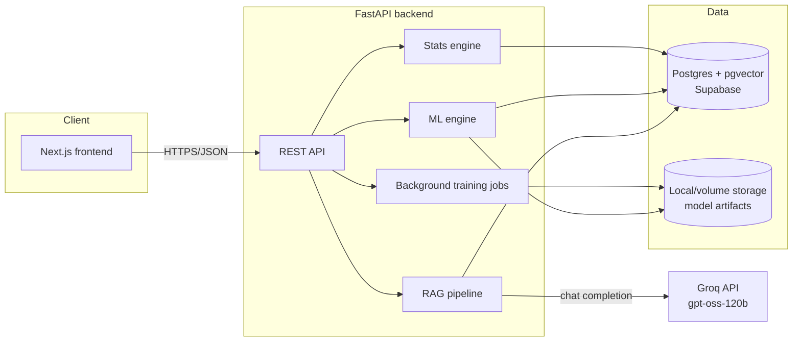

# Architecture

## System overview

## Request flow: running an A/B test

1. Frontend posts raw numbers (Simple Test) or an uploaded dataset + column choices (Advanced Analysis) to `/api/experiments/simple` or `/api/experiments/advanced`.
2. The backend's `stats_engine` (Welch's t-test / Mann-Whitney U / chi-square / two-proportion z-test) computes the result — same math as the original Streamlit prototype, now unit-tested.
3. The result is persisted as an `Experiment` row scoped to the authenticated user (the original app never persisted anything — every session started from zero).
4. The frontend renders the result and can immediately jump into the chat assistant with that experiment's numbers pre-loaded as context.

## Request flow: training an ML model

1. Frontend posts a dataset + target/group columns to `/api/ml/train`.
2. The backend creates an `MLRun` row (`PENDING`) and schedules training via FastAPI `BackgroundTasks`, which runs the CPU-bound scikit-learn training in a worker thread (`asyncio.to_thread`) so it doesn't block the event loop.
3. The job updates the row to `RUNNING`, trains (Gradient Boosting + Random Forest, or a T-learner for uplift), serializes the fitted engine with `joblib`, and writes the bytes to the storage layer (`app/storage.py` — local disk today, swappable for S3).
4. The frontend polls `GET /api/ml/runs/{id}` until `status == "done"` and then can call `/api/ml/predict` against the trained model.

This is a deliberately lightweight async-job pattern (DB-tracked status + `BackgroundTasks`) rather than Celery/Redis — the workload doesn't justify a separate broker/worker fleet, but the pattern (queue → status → poll) is the same one a Celery-backed system would use, so it's a straightforward swap later if training volume grows.

## Request flow: the RAG chat assistant (ABBot)

1. User asks a question, optionally with an `experiment_id` to ground the answer in a specific result.
2. `app/rag/embeddings.py` embeds the question locally with `fastembed` running `sentence-transformers/all-MiniLM-L6-v2` on ONNX runtime — no external API call, no cost, and roughly half the memory footprint of the equivalent PyTorch model (~270MB peak vs. ~540MB), which matters on a memory-constrained free-tier deploy.
3. `app/rag/vector_store.py` runs a cosine-similarity search over `kb_chunks.embedding` (a pgvector column in the same Postgres instance — no separate vector DB service) and returns the top-k matching chunks from the knowledge base under `app/rag/knowledge_base/*.md`.
4. `app/rag/retriever.py` builds a context message combining the retrieved KB chunks and (if provided) the live experiment's stats results, then calls `app/rag/llm_client.py`, which sends the conversation to Groq's free-tier `openai/gpt-oss-120b` model.
5. The answer and the retrieved chunk citations are persisted to `chat_messages` and returned to the frontend, which can display "sources" next to the answer.

The knowledge base is ingested automatically on first backend startup (`main.py`'s `lifespan` hook checks if any `KBDocument` exists) and can be re-ingested after editing the markdown content with `python -m scripts.seed_knowledge_base`.

## Why these specific infra choices

- **pgvector instead of a separate vector DB** (Pinecone, Chroma, Weaviate): one fewer service to run/pay for/monitor. Supabase, Render, Neon, and Fly Postgres all support the `vector` extension, so this doesn't limit deployment options.
- **Groq instead of OpenAI/Anthropic for generation**: free tier, fast inference, OpenAI-compatible-ish chat API — the right tradeoff for a project where cost needs to be zero.
- **fastembed instead of sentence-transformers or a hosted embeddings API**: also free and runs in-process, but on ONNX runtime rather than full PyTorch — same model, same 384-dim output, roughly half the memory footprint, which is the difference between fitting comfortably in a 512MB free-tier instance and reliably OOM-crashing on one.
- **FastAPI BackgroundTasks instead of Celery/Redis**: the training workload is bursty and modest — a dedicated broker and worker fleet would be pure overhead here. The DB-tracked-status pattern is the same shape a queue-backed system uses, so it's not a dead end if the project outgrows it.
- **Local-disk storage behind a `FileStorage` protocol**: keeps day-one infra to "one Postgres, one backend, one frontend." The interface is deliberately narrow (`save_bytes`/`read_bytes`/`new_key`) so an S3-compatible implementation is a single new class, not a rewrite.

## Explicitly out of scope (documented, not built)

- OAuth/social login, email verification, password reset flows
- Billing/subscriptions, multi-tenant organizations
- S3/object storage (the storage layer is ready for it; not wired up)
- Celery/Redis job queue
- Kubernetes manifests
- End-to-end browser tests (Playwright/Cypress)

These were cut deliberately to keep the rewrite's scope achievable while still being a real, deployable product — not because they're hard to imagine adding later.

## Deployment

**Local dev**: `docker compose up` — brings up Postgres (with pgvector preinstalled via the `pgvector/pgvector:pg16` image), the FastAPI backend (runs `alembic upgrade head` on boot), and the Next.js frontend.

**Cloud**:
1. **Database**: use a managed Postgres with the `vector` extension enabled — Supabase, Neon, or Render's managed Postgres all work. Enable the extension once: `create extension if not exists vector;`.
2. **Backend**: deploy `backend/` to Render or Fly as a Docker service. Set `DATABASE_URL` / `DATABASE_URL_SYNC` to your managed Postgres, `GROQ_API_KEY` to a free key from [console.groq.com](https://console.groq.com/keys), and `JWT_SECRET` to a long random string. Attach a persistent volume at `/app/storage` if you want trained models to survive redeploys (otherwise they're ephemeral per-instance — fine for a demo, not for production model persistence).
3. **Frontend**: deploy `frontend/` to Vercel. Set `NEXT_PUBLIC_API_URL` to your deployed backend's URL.
4. **CORS**: set the backend's `CORS_ORIGINS` to your deployed frontend's URL.
